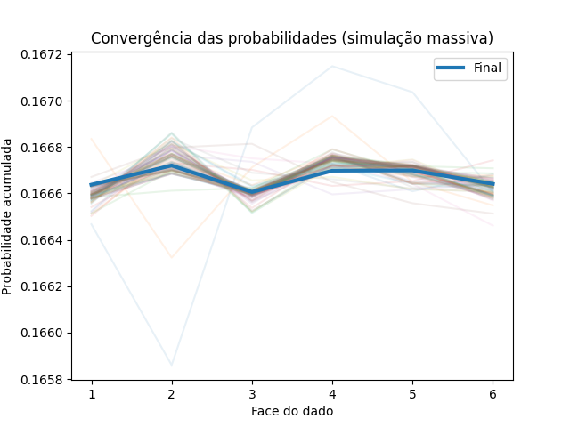

# 🎲 Simulação de Lançamento de Dado

Este mini projeto simula o lançamento de um dado de 6 lados um grande número de vezes e analisa a distribuição dos resultados com base em conceitos de probabilidade e estatística.

---

## 📊 Resultado



O gráfico mostra a convergência das probabilidades observadas para o valor teórico de 1/6 conforme o número de lançamentos aumenta.

---

## 🚀 Como executar

### 1. Instalar dependências

```bash
pip install -r requirements.txt
```

### 2. Rodar simulação simples

```bash
python src/simulacao.py
```

### 3. Gerar gráfico

```bash
python src/grafico.py
```

### 4. Rodar simulação massiva (master)

```bash
python src/master.py
```

---

## 🧠 Conceitos envolvidos

### Probabilidade teórica

Para um dado justo:

```
P(face) = 1/6 ≈ 0.1666
```

### Desvio padrão (distribuição binomial)

Cada face segue uma distribuição binomial:

- `n` = número de lançamentos
- `p` = 1/6

Desvio padrão:

```
σ = sqrt(n * p * (1 - p))
```

Isso representa o erro esperado natural da aleatoriedade.

### Lei dos Grandes Números

À medida que o número de lançamentos aumenta:

- A frequência observada converge para a probabilidade real.
- As oscilações diminuem proporcionalmente.

### Qui-quadrado

Utilizado para verificar se a distribuição observada difere significativamente da esperada:

```
χ² = Σ (observado - esperado)² / esperado
```

Se o valor for baixo, o dado pode ser considerado justo.

---

## ⚙️ Implementação

### Geração dos dados

Utilizamos a biblioteca NumPy:

```python
np.random.randint(1, 7, size=N)
```

Isso é eficiente pois executa em nível de baixo nível (C).

### Contagem

```python
np.bincount(resultados)
```

Muito mais eficiente do que loops em Python.

### Simulação massiva

O script `master.py`:

- Executa múltiplas rodadas
- Acumula resultados
- Plota convergência das probabilidades
- Demonstra empiricamente a Lei dos Grandes Números

---

## 📜 Licença

MIT License

Copyright (c) 2026 Filipe

Permission is hereby granted, free of charge...

```

```
